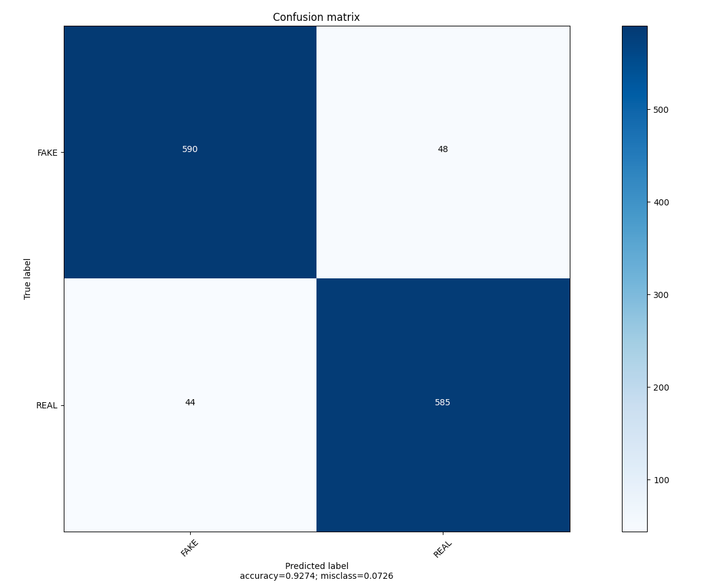

# Fake News Classifier

Fake News Classifier generated by building a Tfidf vectorizer on a 30MB dataset of fake and real news articles, followed by fitting Sklean's linear model PassiveAggressiveClassifier.

The model achieves approximately 92.5% accuracy, as shown by the confusion matrix for predictions on the test set.

